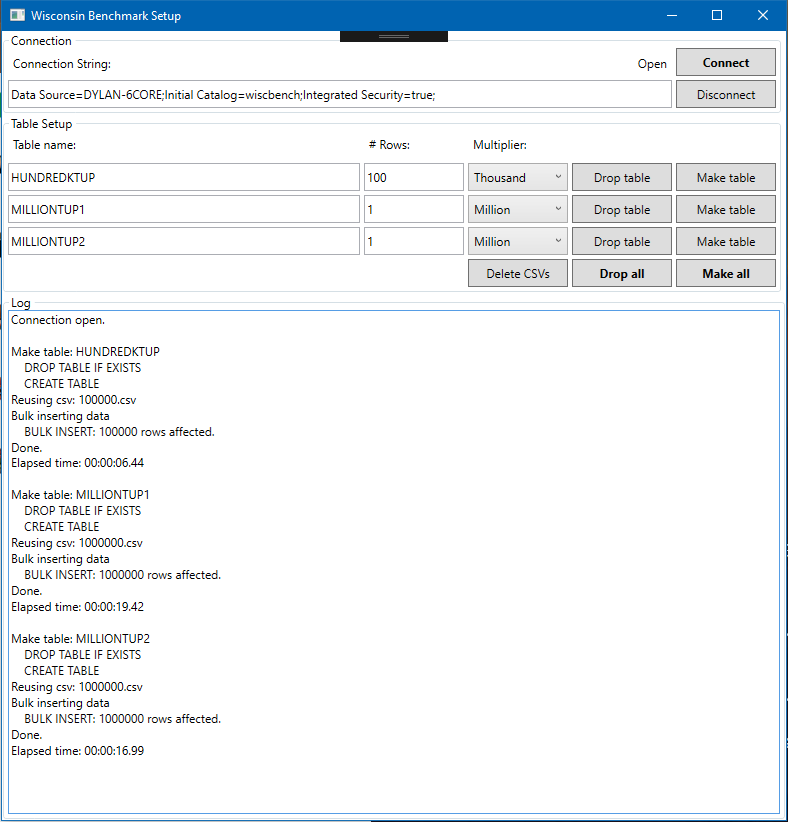
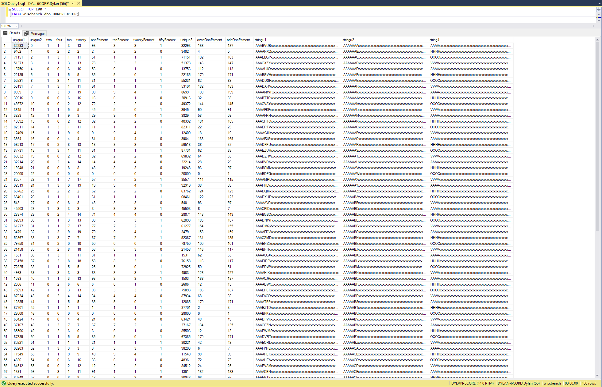

# cs587-dbms-benchmarking
Term project benchmarking Microsoft SQL Server under the Wisconsin Benchmark for CS 587 - DBMS Implementation at Portland State University, spring 2019.

The basis of the project is The Wisconsin Benchmark. Our reference material for this is: [The Wisconsin Benchmark: Past, Present, and Future](http://firebird.sourceforge.net/download/test/wisconsin_benchmark_chapter4.pdf).

## Project Part 2

See file [Part 2.docx](Part 2.docx)

## Project Part 1

Part 1 consists of:

* Writing SQL queries to create tables as prescribed in the DeWitt paper.
* Writing code to generate data sets of arbitrary sizes according to the instructions in the the paper, with modifications as stated in course materials.
* Writing SQL to load data sets into tables.

### Work performed for part 1

Part 1 is wholly contained in the [TermProject/WisconsinSetup](TermProject/WisconsinSetup) and [TermProject/TestConvert](TermProject/TestConvert) C# projects. The latter was a throw-away testbed used for comparing different string conversion algorithms, as the research paper's algorithm was problematic in many ways.

The WisconsinSetup application automates as much as possible of the process of setting up a database for The Wisconsin Benchmark. The rationale behind the decision to automate the setup procedure is to make running benchmarks as simple and painless as possible. Making the setup process easy frees me to focus on generating the highest-quality results possible.

WisconsinSetup is a C# GUI application written using Windows Presentation Foundation (WPF) under a Model-View-ViewModel (MVVM) pattern, making extensive use of data binding to simplify communication between the GUI front-end and the underlying data. Although the project does not call for any of the above, I took the project as a learning opportunity. I began the term with basic knowledge of WPF, and I have now expanded my depth of knowledge and experience considerably.

### Code for Generating Tables and Data

The reference paper provides three main segments of code for part 1. You can find them as follows:

* The SQL for creating the required tables lives in [TermProject/WisconsinSetup/QueryManager.cs](TermProject/WisconsinSetup/QueryManager.cs).
* The code for generating random `unique1` values lives in [TermProject/WisconsinSetup/Relation.cs](TermProject/WisconsinSetup/Relation.cs). (See below for details.)
* The code for generating records from `unique1` and `unique2` values (including generating 52-character strings) lives in [TermProject/WisconsinSetup/Record.cs](TermProject/WisconsinSetup/Record.cs).

**Generating random integers:** The code for generating random values is a bit buried, for good reason. The Relation class implements the IEnumerable interface, which means that we can write code like `foreach (Record r in new Relation(tableName, numberOfRecords)` to iterate over the records in the relation. I adapted the code for generating the relation into the methods of the IEnumerator interface on the private class RelationEnum. The effect of this decision is that the Relation class only generates rows as they are needed. (Note that it does _not_ cache records. Like the paper's record-generation algorithm, the Relation class is designed under the assumption that tables might not fit in main memory.) The primary use case is the `WriteCsv(string csvFilename)` function, which generates rows and immediately writes them to a CSV file. 

Note also that I follow the paper's algorithm for generating random number. For any given table size, the algorithm generates the same sequence of "random" integers every time. Based on the discussion in class, I treat this as a feature rather (ensuring repeatability) rather than a bug. This does mean that tables of the same size will always be identical to each other and identical to other tables of the same size from different benchmark runs.

## DBMS of choice: Microsoft SQL Server 2017

I chose to benchmark SQL Server 2017 using a Developer Edition license. Though the class recommends using Postgresql, I already have enough experience with Postgresql from both CS 586 - Intro to Database Management Systems and my work on the Building Data Systems (BuDS) project with Dr. David Maier (winter through summer of 2019) to feel comfortable with this DBMS. I decided to work chiefly within the Microsoft ecosystem for this class to broaden my experience, as evidenced by my WisconsinSetup application. I also chose to use SQL Server 2017 because I want to observe its performance relative to Postgresql, which I presume many of my classmates will use.

## Evidence of successful data loading

As evidence that I have successfully loaded well-formatted data into SQL Server 2017, I offer screenshots (below) of WisconsinSetup with a successful load log (on large tables) and a screenshot of a table query showing loaded data. The file [SampleData.csv](SampleData.csv) is a sample data file with 50 rows, per project specifications. Note that the paper's random number generator is entirely deterministic and will always generate the same sequence of numbers for any given tuple size (and similar sequences for similar tuple sizes). Since I follow this algorithm, there's no point in uploading three sample files of the same size, as they would be identical.

## Lessons learned & issues encountered

As discussed in class and in online discussions with the TA and instructor, the string conversion algorithm had multiple issues. I worked with said parties to develop the standard string conversion algorithm that the class uses.

I encountered surprising issues with the random number generation code. First, it is extremely fragile, producing non-unique results if the number of tuples if off by one. I confess, I don't understand the math behind the algorithm, so I can't say why this occurs, and I don't understand why it ever actually works!

I encountered issues with WPF data binding and static resources. These mostly revolved around gaps in Microsoft's reference materials that left me unsure of how to proceed at roughly a dozen points in the application's development. However, I was able to learn from various third-party examples and tutorials (of dubious and mixed quality). My key lesson here was ultimately to include `xmlns:diag="clr-namespace:System.Diagnostics;assembly=WindowsBase"` namespace in my XAML in order to enable debugging output.

I learned a bit about how different SQL Server 2017 is from Postgresql and, in turn, how different the Microsoft developer ecosystem is from the Linux developer ecosystem. In particular, I learned that Microsoft's ecosystem comprises a rich fabric of deeply interconnected systems that work best when taken as a whole. For example, after two days of research, I ultimately connected WisconsinSetup to SQL Server 2017 using a Windows account. This is theoretically more secure and easier than using an authentication system built into the DBMS (which SQL Server also supports), but the mere presence of Windows account support in SQL Server made simply connecting to the database a much more daunting task than connecting to Postgresql. 

Additionally, after implementing the MVVM design pattern with data binding, I found that writing course-grained asynchronous code, which had been very painful in my first WPF application, was shockingly simple and easy! Using all of Microsoft's interconnected systems in combination made them all work smoothly and easily. I carry this forth as a valuable lesson learned.

